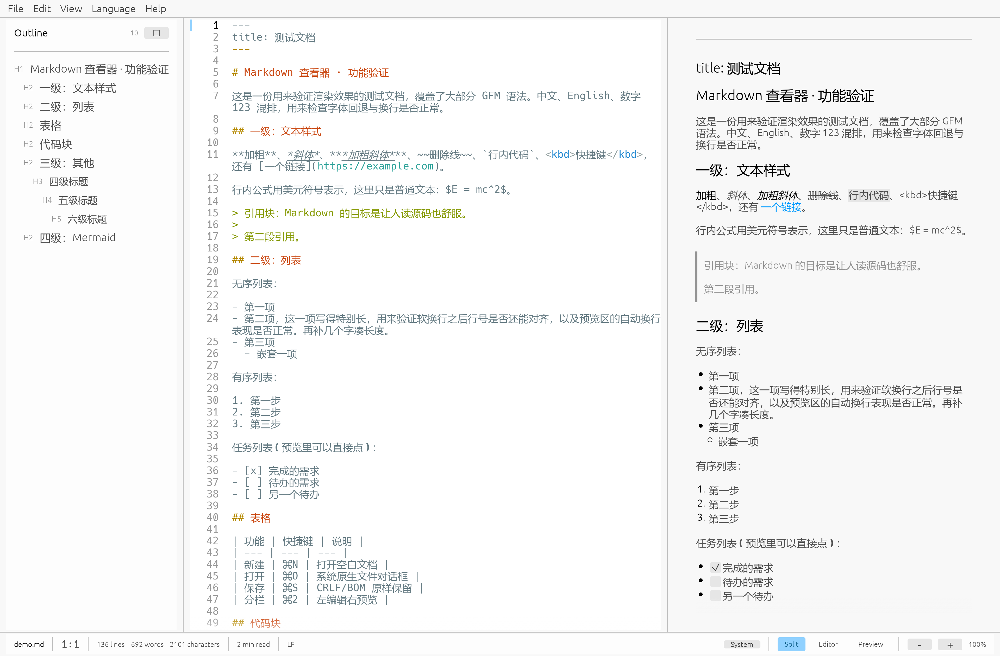

# MarkView

**English** · [简体中文](README.zh-CN.md)

A native Markdown editor and viewer written in Rust: **source on the left, live preview on the
right**. No Node, no browser, no embedded webview — it builds into a single binary you can
double-click.



```bash
cargo run                        # open a blank document
cargo run -- notes.md            # open a file (or just drag one into the window)
```

## Features

**Editing**
- Line-number gutter. Soft-wrapped continuation lines are not numbered, so numbers stay aligned
  no matter how long a line gets.
- Markdown syntax highlighting that follows the light/dark theme.
- An accent bar in the gutter marks the current line.
- Undo / redo (⌘Z / ⌘⇧Z).
- One-shot formatting: bold, italic, strikethrough, inline code, link, list, blockquote, headings.
- Find bar (⌘F) with a live match count and ⌘G / ⌘⇧G to step through matches.

**Preview**
- Full GFM: tables, strikethrough, task lists, footnotes, alerts.
- Syntax-highlighted code blocks (syntect); inline and local images both render.
- **Mermaid diagrams are drawn for real** — parsed, laid out and rasterised in pure Rust, with no
  Node or browser involved. If the syntax is broken, the block falls back to showing its source.
- **Task-list checkboxes in the preview are clickable**, and the change is written back to the
  source text.

**Files**
- Native file dialogs (rfd).
- CRLF / LF and the UTF-8 BOM are preserved exactly on save, so you never pollute a git diff.
- Export to HTML: a self-contained file with its own stylesheet that follows the system
  light/dark setting and prints cleanly.
- Recent-files list, drag and drop, and `markview notes.md` on the command line.
- Unsaved changes are caught before the window closes or another file is opened.

**Interface**
- Outline sidebar; clicking a heading jumps to that line (and `#` inside fenced code blocks is
  correctly ignored).
- Three layouts: editor only / split / preview only (⌘1 / ⌘2 / ⌘3).
- Light and dark themes (follow the system, or force either), ⌘+ / ⌘- to zoom.
- Window size, panel widths, preferences and recent files are all remembered.
- **English and Simplified Chinese UI**, switchable at runtime from the *Language* menu.

## Keyboard shortcuts

On macOS these use ⌘; elsewhere `Command` maps to Ctrl.

| Key | Action |
| --- | --- |
| ⌘N / ⌘O | New / Open |
| ⌘S / ⌘⇧S | Save / Save As |
| ⌘E | Export as HTML |
| ⌘1 / ⌘2 / ⌘3 | Editor only / Split / Preview only |
| ⌘⇧O / ⌘⇧L | Outline / Line numbers |
| ⌘⇧T | Cycle theme |
| ⌘+ / ⌘- / ⌘0 | Zoom in / out / reset |
| ⌘Z / ⌘⇧Z | Undo / Redo |
| ⌘B / ⌘I / ⌘⇧X | Bold / Italic / Strikethrough |
| ⌘K / ⌘⇧C | Link / Inline code |
| ⌘⇧U / ⌘⇧P | Bullet list / Blockquote |
| ⌘⌥1 / ⌘⌥2 / ⌘⌥3 | Heading 1 / 2 / 3 |
| ⌘F | Open the find bar |
| ⌘G / ⌘⇧G | Next / previous match |

## Building

Rust **1.95 or newer** (the crate uses edition 2024).

```bash
git clone <this repo>
cd markview
cargo build --release
./target/release/markview
```

Or install it into your `PATH`:

```bash
cargo install --path .
```

### macOS app bundle

macOS ignores window-level icons — the Dock and Finder only read `CFBundleIconFile` from an
`.app` bundle. To get the real icon, build the bundle:

```bash
packaging/build-app.sh          # -> dist/MarkView.app
```

## Project layout

```
src/
  main.rs          Entry point: window options, drag-and-drop, render backend
  app.rs           Application state machine: action queue, main loop, shortcut table
  document.rs      Document model: disk I/O, CRLF/BOM fidelity, dirty flag
  prefs.rs         Preferences (serde-persisted through eframe storage)
  i18n.rs          UI string table (English / Simplified Chinese)
  markdown.rs      Pure logic: outline extraction, word count, HTML export
  mermaid.rs       Pure logic: split on mermaid fences, render, bitmap cache
  fonts.rs         CJK font loading
  ui/
    mod.rs         Theme and style tweaks
    menu.rs        Top menu bar
    editor.rs      Editor: gutter, highlighting, find bar, formatting actions
    preview.rs     Preview pane
    outline.rs     Outline sidebar
    status.rs      Bottom status bar
    dialogs.rs     About / shortcuts / unsaved-changes dialogs
    find.rs        Find state and matching
tests/fixtures/    Manual fixtures (see Testing)
```

### Three design notes

**Interaction is a two-step process.** UI code only pushes *what the user wants* into a
`Vec<Action>`; everything is executed after all panels have been drawn. That way menu items and
keyboard shortcuts share one implementation, and drawing the UI never fights the borrow checker.
Actions such as `SaveAndProceed` append further actions to the end of the queue, so the dispatch
loop is allowed to grow while it runs.

**Line numbers are aligned from the galley, not from guesswork.** `TextEdit::show()` returns the
laid-out `Galley` together with its on-screen position (`galley_pos`), and every row in
`Galley.rows` carries a relative `pos` plus an `ends_with_newline` flag. So "which y does logical
line N start at" can be computed exactly — even when a long line is soft-wrapped into several
screen rows, the number is drawn only at the start of the logical line and **never drifts**. A
unit test pins this down (`soft_wrapped_continuation_does_not_start_a_new_line`).

**Mermaid has to be split out by hand.** `egui_commonmark` offers no hook for custom code-block
rendering (only inline HTML and math callbacks), so every fenced block goes through syntax
highlighting. When the preview sees a `mermaid` fence it splits the document at the fences: Markdown
segments still go to `egui_commonmark`, and Mermaid segments are rendered to a bitmap by
`merman` — again pure Rust, no Node, browser or subprocess. Splitting has a cost: syntax that
straddles a fence (a footnote reference separated from its definition, say) no longer resolves
across segments, which is why the split only happens when a Mermaid fence is actually present.

Bitmaps are cached by (source, light/dark, zoom factor, canvas colour) and only the segment that
changed is recomputed. Recomputing is not cheap — roughly half a second for a small diagram in a
debug build, dominated by parsing, layout and resvg rasterisation — so there is an extra 250 ms of
settling time after the last keystroke: while you type, the previous bitmap stays on screen, and
only once you stop does it get replaced. Colours come from `merman`'s host theme, fed with egui's
page background and light/dark flag: the default pipeline copies Mermaid and writes
`background-color:white` onto the root node, which is a glaring white slab on a dark UI (a unit
test pins that down as well).

## Testing

```bash
cargo test
```

- `ui/editor.rs` — lays out text for real inside a headless `egui::Context` and checks that
  soft-wrapped continuations are not numbered, that gutter y offsets strictly increase, that a
  trailing newline yields an extra line, and that Chinese text is measured in characters rather
  than bytes.
- `ui/find.rs` — matching, case insensitivity, wrap-around stepping, empty queries.
- `mermaid.rs` — fence splitting: a `mermaid` fence nested inside another fence does not count,
  unterminated fences, CRLF, and the invariant that re-joining every segment reproduces the
  source byte for byte.
- `i18n.rs` — placeholder filling, English singular/plural selection, and a check that both
  language tables stay in lockstep.

`tests/fixtures/linetest.md` is a manual fixture: each line carries its own number inside the
text, so you can open it (`cargo run -- tests/fixtures/linetest.md`) and confirm that the gutter
agrees with what the document says.

## Dependencies

| Crate | Purpose |
| --- | --- |
| `eframe` / `egui` | Native window and immediate-mode UI (wgpu / Metal) |
| `egui_commonmark` + `pulldown-cmark` | Markdown / GFM rendering |
| `merman` | Mermaid rendering (pure Rust: parse + layout + SVG + rasterise) |
| `egui_extras` | syntect syntax highlighting, image loading |
| `rfd` | Native file dialogs |
| `skrifa` | Validating that system fonts parse (epaint panics if they do not) |

## About CJK fonts

egui ships Latin glyphs only, so CJK text renders as empty boxes unless a system font is added as
a fallback. At startup MarkView walks a list of common paths (macOS → Linux → Windows) and takes
the first one that `skrifa` can parse. If none is found the app still runs — CJK text just shows
as boxes — and never crashes.

Testing on macOS 26 hit `/System/Library/Fonts/Hiragino Sans GB.ttc`; note that this machine has
**no** `PingFang.ttc`, which is why the candidate list cannot contain PingFang alone.

## Screenshots in development

You can verify rendering on a machine without screen-recording permission — egui captures
through the app's own framebuffer rather than the OS:

```bash
MARKVIEW_SCREENSHOT=/tmp/shot.png cargo run -- demo.md
```

The app renders a few stable frames, writes the window contents to a PNG, and exits. Images
decode asynchronously, so if the document embeds a large image, give it more frames with
`MARKVIEW_SCREENSHOT_FRAMES=120`.

## Render backend on Windows

eframe's default wgpu backend also offers **Vulkan** on Windows, and wgpu enumerates adapters in
bit order with Vulkan first, so it readily picks the Intel iGPU's Vulkan driver. On some driver
versions `igvk64.dll` dereferences a null pointer while creating the surface / swapchain and the
process dies with `0xc0000005 STATUS_ACCESS_VIOLATION` — inside a C-level graphics driver, so
Rust's panic hook never runs and all you get is a meaningless exit code.

So `pick_render_backend()` in `main.rs` pins the backend to **DX12** on Windows and stays out of
that lottery. You can still override it by hand:

```powershell
$env:WGPU_BACKEND="gl"; .\markview.exe      # or dx12 / vulkan
```

When diagnosing this kind of crash, Windows Event Viewer → "Application Error" names the faulty
module directly (in this case `igvk64.dll`).

## License

[MIT](LICENSE).
