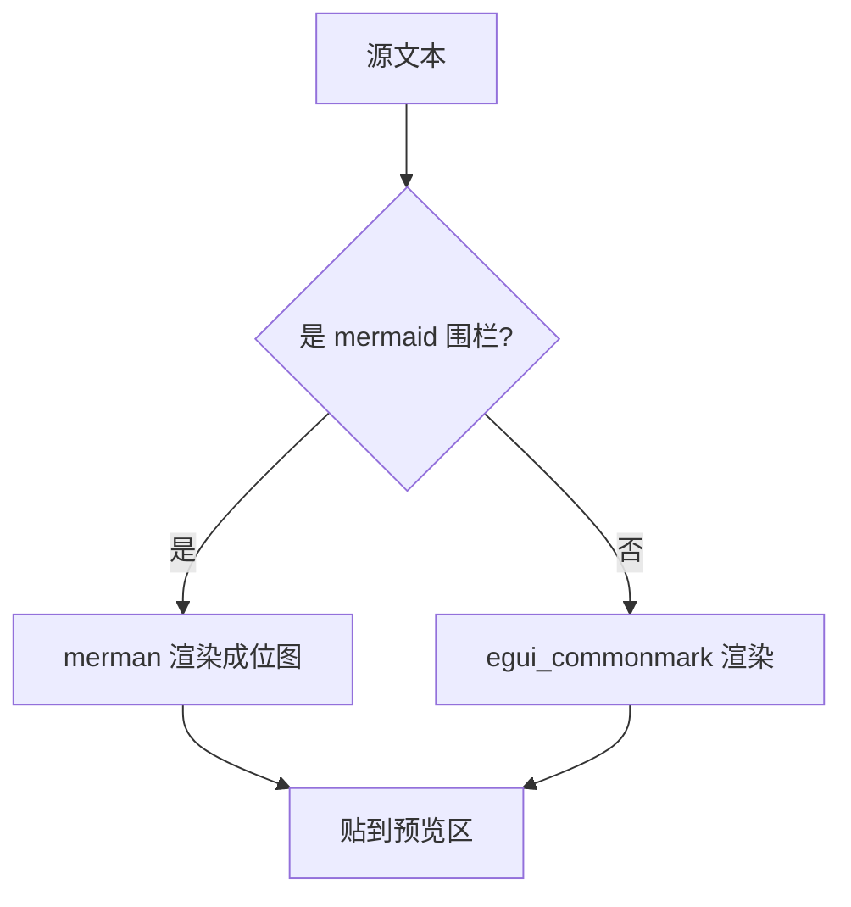
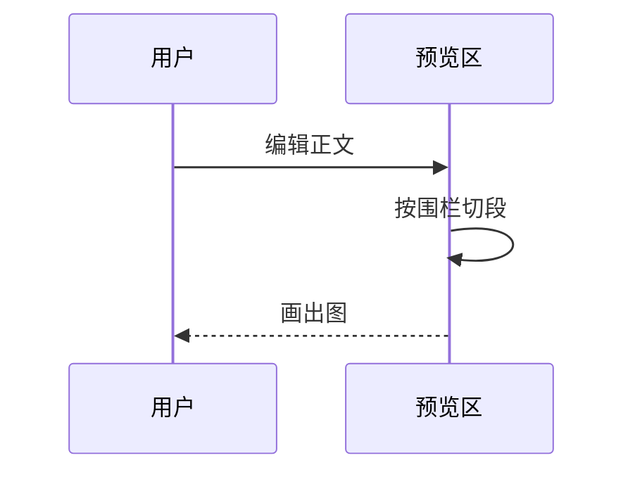

# MarkView · 功能验证

这是一份用来验证渲染效果的测试文档，覆盖了大部分 GFM 语法。中文、English、数字 123 混排，用来检查字体回退与换行是否正常。

## 一级：文本样式

**加粗**、*斜体*、***加粗斜体***、~~删除线~~、`行内代码`、<kbd>快捷键</kbd>，还有 [一个链接](https://example.com)。

行内公式用美元符号表示，这里只是普通文本：$E = mc^2$。

> 引用块：Markdown 的目标是让人读源码也舒服。
>
> 第二段引用。

## 二级：列表

无序列表：

- 第一项
- 第二项，这一项写得特别长，用来验证软换行之后行号是否还能对齐，以及预览区的自动换行表现是否正常。再补几个字凑长度。
- 第三项
  - 嵌套一项
  
有序列表：

1. 第一步
2. 第二步
3. 第三步

任务列表（预览里可以直接点）：

- [x] 完成的需求
- [ ] 待办的需求
- [ ] 另一个待办

## 表格

| 功能 | 快捷键 | 说明 |
| --- | --- | --- |
| 新建 | ⌘N | 打开空白文档 |
| 打开 | ⌘O | 系统原生文件对话框 |
| 保存 | ⌘S | CRLF/BOM 原样保留 |
| 分栏 | ⌘2 | 左编辑右预览 |

## 代码块

```rust
/// 语法高亮走的是 syntect，主题跟随深浅色切换。
pub fn outline(text: &str) -> Vec<Heading> {
    let mut headings = Vec::new();
    let mut fence: Option<(char, usize)> = None;
    for (line_no, raw) in text.lines().enumerate() {
        let trimmed = raw.trim();
        // 围栏代码块内部不参与大纲提取
        if let Some(c) = trimmed.chars().next().filter(|c| *c == '`' || *c == '~') {
            let run = trimmed.chars().take_while(|ch| *ch == c).count();
            if run >= 3 {
                fence = if fence.is_some() { None } else { Some((c, run)) };
                continue;
            }
        }
        if fence.is_some() { continue; }
        // ...
    }
    headings
}
```

```python
def reading_time(words: int, cjk: int) -> float:
    """中文 400 字/分钟，英文 220 词/分钟。"""
    return words / 220 + cjk / 400
```

```bash
# 无语言标记的代码块也不该崩
echo "hello" | wc -c
```

## 三级：其他

水平分割线：

---

脚注引用[^1]，以及第二个脚注[^2]。

[^1]: 脚注内容是 GFM 扩展。
[^2]: egui_commonmark 支持脚注。

### 四级标题

#### 五级标题

##### 六级标题

最后一个段落，用来确认文档末尾的渲染间距是否正常。

## 四级：Mermaid

围栏语言写成 `mermaid` 就会画成图，而不是显示代码块：



时序图也支持：



同一个围栏写在别的语言标记下就还是代码块：

```text
graph TD
  A --> B
```

> 说明：Mermaid 段是独立渲染的，所以它前后各自成段 ——
> 跨段的语法（比如脚注引用和脚注定义被隔开）不会互相解析。
